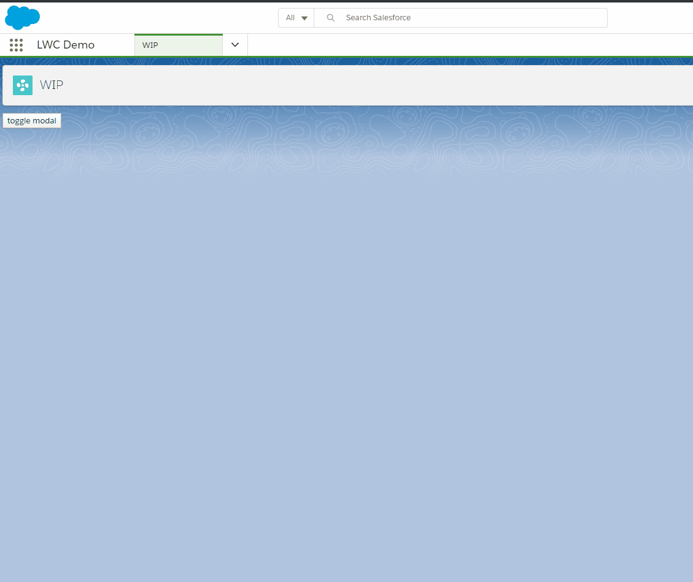

# lwc-modal

A drop-in Lightning Web Component modal.

## Public members

 1. `isShown`, property, Boolean (Default: false) - Whether the modal is shown.
 1. `size`, property, String (Default: medium) - Accepted values: small, medium, large
 1. `onclosed`, event - Event fired when the modal is closed.
 1. `closeModal()`, method - Close the modal.
 1. `showModal()`,  method - Show the modal.
 1. `toggleModal()`, method - Toggle the modal state (close/show).

## Slots

 1. header
 1. default
 1. footer

## Demo

Click close, or press ESC Key to close the modal.



## Usage

myComponent.html
```html
<template>
  <button onclick={toggleModal}>toggle modal</button>

  <c-modal is-shown={isShown}
    onclose={handleClosed}>

    <div slot="header">my header</div>

    <!-- content here goes to the default (body) slot -->
    body

    <div slot="footer">my footer</div>
  </c-modal>
</template>
```

myComponent.js
```javascript
import { LightningElement, track } from 'lwc'

export default class MyComponent extends LightningElement {
  @track isShown = false

  toggleModal () {
    this.isShown = !this.isShown
  }

  handleClosed () {
    this.isShown = false
  }
}
```